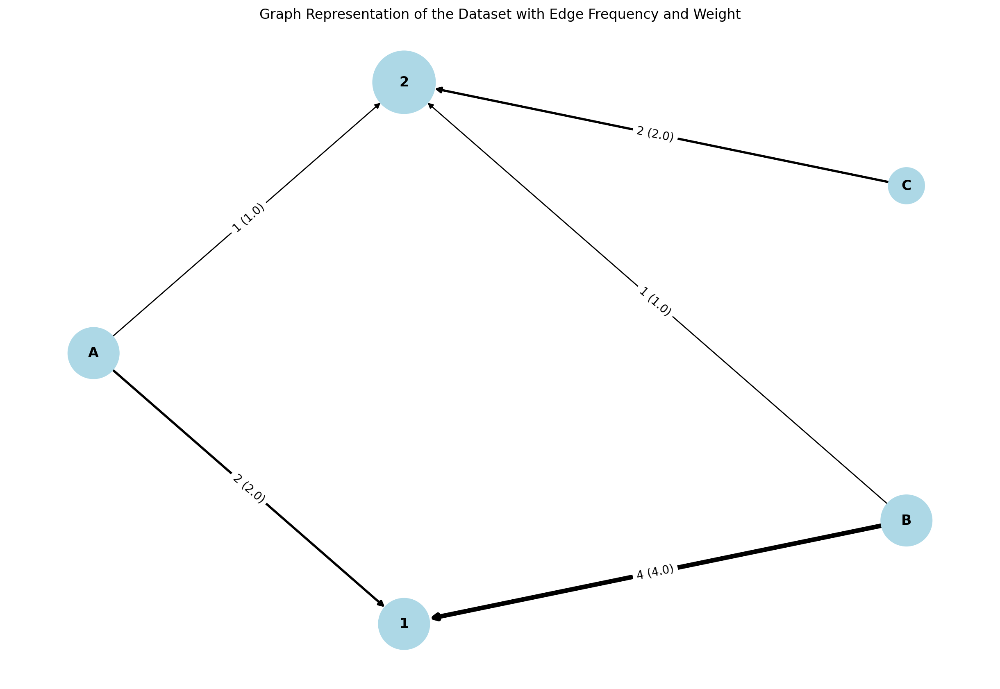
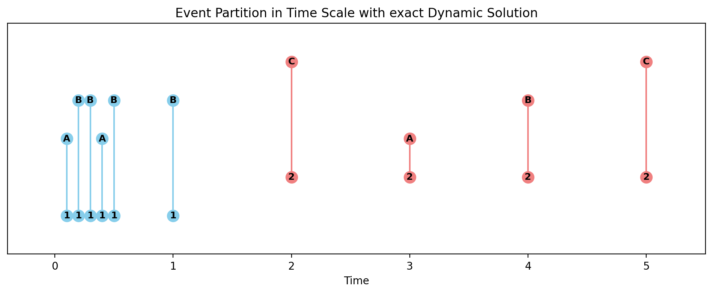
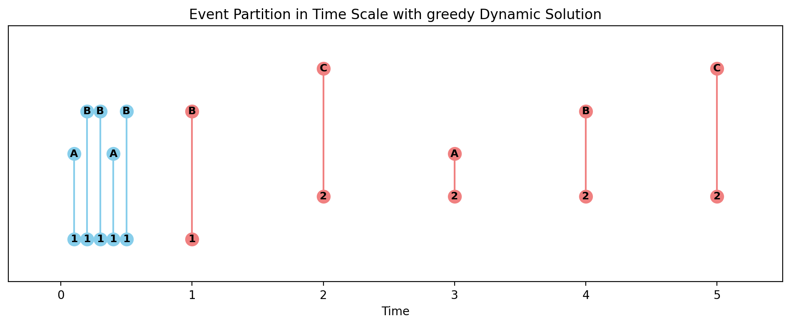

Hypergraph Binning 
+++++++++

Tutorial 
===============
Code to perform hypergraph binning methods derived in "Constructing hypergraphs from temporal data", with example ipython notebook.

The New York City FourSquare checkins dataset used in the paper can be downloaded from [Kaggle](https://www.kaggle.com/datasets/chetanism/foursquare-nyc-and-tokyo-checkin-dataset?resource=download).

If you use this algorithm in your work, please cite:

A. Kirkley, Inference of dynamic hypergraph representations in temporal interaction data. Preprint arXiv:2308.16546 (2023).

.. _equation1:

.. math::

    \mathcal{L}_{\text{total}}(\mathcal{X}, \tau) = \sum_{k=1}^{K} \mathcal{L}_{\text{cluster}}^{(k)} \tag{1}

where

.. _equation2:

.. math::

    \mathcal{L}_{\text{cluster}}^{(k)} = \log(N - 1)(T - 1) + \log\left(\binom{S}{m_k}\binom{D}{m_k}\binom{\tau_k}{m_k}\right) + \left[\log \Omega(s^{(k)}, d^{(k)}) + \log \Omega(G^{(k)}, n^{(k)}) \right] \tag{2}

We can now minimize our MDL objective in Eq. :eq:`1` using a dynamic program. The key intuition behind this is that since the objective in Eq. :eq:`1` is a sum of independent terms over clusters in one dimension, its minimum over the first :math:`j` time steps—i.e., the optimal binning :math:`\tau` restricted to these first :math:`j` time steps—must consist of the optimal binning up to some time step :math:`i \in \{1, ..., j\}` (excluding the :math:`i`-th time step) plus a final cluster of time steps :math:`i, ..., j`.

MDL Hypergraph Binning
======================

This module provides functions to calculate the logarithm of binomial and multinomial coefficients, as well as to identify the Minimum Description Length (MDL) configuration for hypergraph binning.

Functions
---------

All of the following functions are provided in this module and have the same general usage as described below.

.. list-table:: Functions
   :header-rows: 1

   * - Function
     - Description
   * - `logchoose(n, k) <#logchoose>`_
     - Compute the logarithm of the binomial coefficient.
   * - `logmult(counts) <#logmult>`_
     - Compute the logarithm of the multinomial coefficient over count data.
   * - `logOmega(rs, cs, swap=True) <#logOmega>`_
     - Compute the logarithm of the number of non-negative integer matrices with specified row and column sums.
   * - `MDL_hypergraph_binning(X, dt, exact=True) <#MDL_hypergraph_binning>`_
     - Identify the MDL-optimal temporally contiguous partition of event data.
   * - `MDL_hypergraph_binning.DL(i, j) <#DL>`_
     - Compute the cluster-level description length.

Reference
---------

.. _logchoose:

.. raw:: html

   

       function logchoose(n, k) <a href="#logchoose" class="source-link">[source]</a>
   

**Description**:
Compute the logarithm of the binomial coefficient.

**Parameters**:

.. raw:: html

   

       (n, k)
   

   <ul class="parameter-list">
       <li>n: Total number of items.</li>
       <li>k: Number of chosen items.</li>
   </ul>

**Returns**:
  - **float**: Logarithm of the binomial coefficient.

.. _logmult:

.. raw:: html

   

       function logmult(counts) <a href="#logmult" class="source-link">[source]</a>
   

**Description**:
Compute the logarithm of the multinomial coefficient over count data.

**Parameters**:

.. raw:: html

   

       (counts)
   

   <ul class="parameter-list">
       <li>counts: Count data for which the multinomial coefficient is calculated.</li>
   </ul>

**Returns**:
  - **float**: Logarithm of the multinomial coefficient.

.. _logOmega:

.. raw:: html

   

       function logOmega(rs, cs, swap=True) <a href="#logOmega" class="source-link">[source]</a>
   

**Description**:
Compute the logarithm of the number of non-negative integer matrices with specified row and column sums.

**Parameters**:

.. raw:: html

   

       (rs, cs, swap=True)
   

   <ul class="parameter-list">
       <li>rs: Array of row sums.</li>
       <li>cs: Array of column sums.</li>
       <li>swap: Boolean to swap the definition of rows and columns for a minor accuracy improvement.</li>
   </ul>

**Returns**:
  - **float**: Logarithm of the number of non-negative integer matrices.

.. _MDL_hypergraph_binning:

.. raw:: html

   

       function MDL_hypergraph_binning(X, dt, exact=True) <a href="#MDL_hypergraph_binning" class="source-link">[source]</a>
   

**Description**:
Identify the MDL-optimal temporally contiguous partition of event data.

**Parameters**:

.. raw:: html

   

       (X, dt, exact=True)
   

   <ul class="parameter-list">
       <li>X: List of event data entries, each in the form [s_i, d_i, w_i, t_i].</li>
       <li>dt: Time step width, calculated as (t_N - t_1) / T.</li>
       <li>exact: Boolean to indicate whether to use the exact dynamic programming solution.</li>
   </ul>

**Returns**:
  - **best_MDL/L0**: Compression ratio eta for MDL-optimal temporally contiguous partition of event data X.
  - **labels**: Partition of the event data into event clusters.
  - **T**: Number of time steps corresponding to width dt.

.. _DL:

.. raw:: html

   

       function MDL_hypergraph_binning.DL(i, j) <a href="#DL" class="source-link">[source]</a>
   

**Description**:
Compute the cluster-level description length.

**Parameters**:

.. raw:: html

   

       (i, j)
   

   <ul class="parameter-list">
       <li>i: Interval start index.</li>
       <li>j: Interval end index.</li>
   </ul>

**Returns**:
  - **float**: Cluster-level description length.

Demo
====

The following example demonstrates how to use the ``MDL_hypergraph_binning`` function on an event dataset ``X`` with a time step width ``dt``.

Example Code
------------

.. code-block:: python

  import time
  import ScholarCodeCollective as SCC
  from ScholarCodeCollective.hypergraph_binning_main import MDL_hypergraph_binning, logOmega, logchoose
  import matplotlib
  import matplotlib.pyplot as plt
  import numpy as np
  import networkx as nx
  import matplotlib
  from collections import Counter, defaultdict

  X = [('a1','b2',1,1.1),('a1','b3',1,1.5),('a1','b2',1,1.6),('a2','b2',1,1.7),('a2','b3',1,1.9),\
      ('a4','b5',1,5.5),('a1','b3',1,150),('a1','b3',1,160),('a4','b6',1,170),('a2','b3',1,190)]
  dt = 1

  start_exact = time.time()
  results_exact = MDL_hypergraph_binning(X,dt,exact=True)
  runtime_exact = time.time() - start_exact

  start_greedy = time.time()
  results_greedy = MDL_hypergraph_binning(X,dt,exact=False)
  runtime_greedy = time.time() - start_greedy

  print('Exact Dynamic Program Results: ')
  print('     compression ratio =',round(results_exact[0],4))
  print('     MDL-optimal event partition =',results_exact[1])
  print('     number of time steps =',results_exact[2])
  print('     runtime =',round(runtime_exact,4))

  print('Greedy Algorithm Results: ')
  print('     compression ratio =',round(results_greedy[0],4))
  print('     MDL-optimal event partition =',results_greedy[1])
  print('     number of time steps =',results_greedy[2])
  print('     runtime =',round(runtime_greedy,4))

  def visualize_nework(X):
      edge_freq = Counter((orig, dest) for orig, dest, _, _ in X)
      edge_weight_sum = defaultdict(int)
      for orig, dest, weight, _ in X:
          edge_weight_sum[(orig, dest)] += weight
      G = nx.DiGraph()
      for (orig, dest), freq in edge_freq.items():
          G.add_edge(orig, dest, weight=edge_weight_sum[(orig, dest)], freq=freq)
      node_sizes = [1000 * G.degree(n) for n in G.nodes()]
      pos = nx.shell_layout (G)
      
      edge_labels = {(u, v): f"{d['freq']} ({d['weight']:.1f})" for u, v, d in G.edges(data=True)}
      edge_weights = [d['weight'] for u, v, d in G.edges(data=True)]
      
      plt.figure(figsize=(12, 8))
      nx.draw(G, pos, with_labels=True, node_size=node_sizes, node_color="lightblue", font_weight="bold", arrows=True, width=edge_weights)
      nx.draw_networkx_edge_labels(G, pos, edge_labels=edge_labels)
      plt.title("Graph Representation of the Dataset with Edge Frequency and Weight")
      plt.savefig("graph.png", bbox_inches='tight', dpi=200)
      plt.show()
      
  visualize_nework(X)

    def visualize_binning(X, result, method):
        labels = result[1]
        times = [t for _, _, _, t in X]
        pairs = [(src, dest) for src, dest, _, _ in X]
        times_transformed= np.log2(times)
        
        jitter = np.random.normal(0, 0.1, len(times))
        times_jittered = [t  for t, j in zip(times_transformed, jitter)]
        colors = ['skyblue' if label == 0 else 'lightcoral' for label in labels]
        
        fig, ax = plt.subplots(figsize=(12, 4))
        nodes = list(set([src for src, dest in pairs] + [dest for src, dest in pairs]))
        node_pos = {node: i for i, node in enumerate(nodes)}
        node_pos = {node: pos for i, (node, pos) in enumerate(node_pos.items())}
        for (src, dest), time, color in zip(pairs, times_jittered, colors):
            src_pos = node_pos[src]
            dest_pos = node_pos[dest]
            ax.plot([time, time], [src_pos, dest_pos], color=color, marker='o', markersize=11, linestyle='-', zorder=1)
            ax.text(time, src_pos, f"{src}", ha='center', va='center', fontsize=9, fontweight='bold', zorder=2, color='black')
            ax.text(time, dest_pos, f"{dest}", ha='center', va='center', fontsize=9, fontweight='bold', zorder=2, color='black')
        
        ax.set_xlim(min(times_jittered) - 0.5, max(times_jittered) + 0.5)
        ax.set_ylim(min(node_pos.values()) - 1, max(node_pos.values()) + 1)
        ax.set_yticks([])
        ax.set_xlabel('Transformed Time')
        ax.set_title(f'Event Partitionin Time Scale with {method} Dynamic Solution')
        plt.savefig(f"timeline_plot_with_log_transform_{method}.png", bbox_inches='tight', dpi=200)
        plt.show()
    visualize_binning(X, results_exact, 'exact')
    visualize_binning(X, results_greedy, 'greedy')

Example Output
--------------

.. code-block:: text

    Exact Dynamic Program Results: 
         compression ratio = 0.8502
         MDL-optimal event partition = [0 0 0 0 0 1 1 1 1 1]
         number of time steps = 189
         runtime = 0.0711
    Greedy Algorithm Results: 
         compression ratio = 0.8581
         MDL-optimal event partition = [0 0 0 0 0 0 1 1 1 1]
         number of time steps = 189
         runtime = 0.0213

Example output showing the example graph structure.

Example output showing the hypergraph binning results for the example graph with the exact dynamic programming solution.

Example output showing the hypergraph binning results for the example graph with the greedy dynamic programming solution.

Link 
====

Paper source
------------
https://arxiv.org/abs/2308.16546

