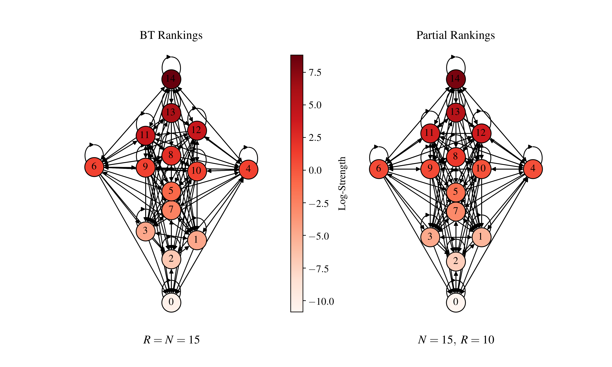

Partial Rankings
+++++++++++++++++

Tutorial
========

Code to infer partial rankings from pairwise interactions, paired comparisons are a standard method to infer a ranking between a series of players/actors. A shortcoming of many of these methods is that they lack mechanisms that allow for partial rankings --rankings where multiple nodes can have the same rank. Derived in "Learning when to rank: Estimation of partial rankings from sparse, noisy comparisons" (Morel-Balbi, Kirkley, 2025, https://arxiv.org/pdf/2501.02505).

The `partial_rankings` function minimizes the description length (DL) based on pairwise interactions to infer partial rankings. Preprocessing utilities are provided to prepare match data for analysis.

Inputs include:

- **match_list:** Array of matches of the form :math:`[[i, j],...]` or :math:`[[i, j, w_{ij}],...]`, where :math:`w_{ij}` is the number of times player :math:`i` beats player :math:`j`.
- **N:** Number of unique players in the match list.
- **M:** Number of matches in the match list.
- **e_out, e_in:** Dictionaries representing out-edges and in-edges for each node.
- **TARGET:** Convergence criterion for iterative updates.

Outputs include:

- **R:** Number of unique ranks inferred.
- **DL:** Description length of the optimal ranking configuration.
- **LPOR:** Log-posterior odds ratio of the inferred rankings relative to a baseline.
- **Strengths:** Dictionary of player strengths.
- **Clusters:** Grouping of nodes into ranks.

The method minimizes the following MDL objective at each step of the ranking inference:

**Description Length Objective for Ranking Inference:**

.. math::

    \mathcal{L} = C(R) + \sum_{r} g(r, \sigma_r) + \sum_{r, s} f(r, s, \sigma_r, \sigma_s)

Where:

- :math:`C(R)` is the global contribution to description length.
- :math:`g(r, \sigma_r)` is the node-level contribution.
- :math:`f(r, s, \sigma_r, \sigma_s)` is the interaction contribution.

Partial Rankings
================

This module provides preprocessing functions for match lists and a core function for inferring partial rankings.

.. list-table:: Functions
   :header-rows: 1

   * - Function
     - Description
   * - `get_N(match_list) <#get-n>`_
     - Compute the number of unique players in the match list.
   * - `get_M(match_list, return_unique=False) <#get-m>`_
     - Compute the number of matches in the match list.
   * - `get_edges(match_list) <#get-edges>`_
     - Extract the in and out edges from the match list.
   * - `partial_rankings(N, M, e_out, e_in, ...) <#partial-rankings-main>`_
     - Infer rankings from pairwise interactions.

Reference
---------

.. _get-n:

.. raw:: html

   

       function get_N(match_list) 
       <a href="../Code/partial_rankings.html#get-n" class="source-link">[source]</a>
   

**Description**:
Compute the number of unique players in the match list.

**Parameters**:

.. raw:: html

   

       (match_list)
   

   <ul class="parameter-list">
       <li>match_list: Array of matches of the form :math:`[[i, j],...]` or :math:`[[i, j, w_{ij}],...]`.</li>
   </ul>

**Returns**:
  - **int**: Number of unique players.

.. _get-m:

.. raw:: html

   

       function get_M(match_list, return_unique=False) 
       <a href="../Code/partial_rankings.html#get-m" class="source-link">[source]</a>
   

**Description**:
Compute the number of matches in the match list.

**Parameters**:

.. raw:: html

   

       (match_list, return_unique=False)
   

   <ul class="parameter-list">
       <li>match_list: Array of matches.</li>
       <li>return_unique: Boolean indicating whether to also return the number of unique matches.</li>
   </ul>

**Returns**:
  - **int**: Number of matches.
  - **int (optional)**: Number of unique matches.

.. _get-edges:

.. raw:: html

   

       function get_edges(match_list) 
       <a href="../Code/partial_rankings.html#get-edges" class="source-link">[source]</a>
   

**Description**:
Extract the in and out edges from the match list.

**Parameters**:

.. raw:: html

   

       (match_list)
   

   <ul class="parameter-list">
       <li>match_list: Array of matches.</li>
   </ul>

**Returns**:
  - **e_out**: Dictionary of out-edges.
  - **e_in**: Dictionary of in-edges.

.. _partial-rankings-main:

.. raw:: html

   

       function partial_rankings(N, M, e_out, e_in, TARGET, force_merge, exact, sync, full_trace, verbose) 
       <a href="../Code/partial_rankings.html#partial-rankings-main" class="source-link">[source]</a>
   

**Description**:
Infer partial rankings from pairwise interactions by minimizing the description length.

**Parameters**:

.. raw:: html

   

       (N, M, e_out, e_in, TARGET, force_merge, exact, sync, full_trace, verbose)
   

    <ul class="parameter-list">
        <li>N: Integer number of nodes (players).</li>
        <li>M: Integer Number of edges (matches).</li>
        <li>e_out: Dictionary of out-edges.</li>
        <li>e_in: Dictionary of in-edges.</li>
        <li>TARGET: Float of convergence criterion, defaults to 1e-6.</li>
        <li>force_merge: Boolean to enforce merging of clusters with positive delta description length, defaults to True.</li>
        <li>exact: Boolean to use exact computation of player strengths, defaults to True.</li>
        <li>sync: Boolean to enable synchronous computation, defaults to False.</li>
        <li>full_trace: Boolean to return results at each merge step, defaults to False.</li>
        <li>verbose: Boolean to print verbose output, defaults to False.</li>
    </ul>

   </ul>

**Returns**:
  - **list**: If ``full_trace=True``, returns a list of dictionaries, each containing the results at every merge step, including the number of ranks, description length, strengths, and clusters.
  - **dict**: If ``full_trace=False``, returns a dictionary containing results at the minimum description length, including:
    - **R**: Number of ranks inferred.
    - **DL**: Description length at the minimum.
    - **LPOR**: Log-posterior odds ratio relative to the baseline.
    - **Strengths**: Dictionary of player strengths.
    - **Clusters**: Grouping of nodes into ranks.

Demo
====

Example Code
------------

This example demonstrates how to use the `partial_rankings` module to infer rankings from a match list, preprocess the data, and visualize the results.

**Step 1: Import necessary libraries**

.. code-block:: python

    from collections import Counter
    import networkx as nx
    import matplotlib
    import matplotlib.image as mpimg
    import matplotlib.pyplot as plt
    import matplotlib.colors as mcolors
    import numpy as np
    from paninipy.partial_rankings import partial_rankings, get_N, get_M, get_edges

**Step 2: Create a class for preprocessing and plotting**

.. code-block:: python

    class RankingPlotGenerator:
        def __init__(self, matchlist_file):
            self.matchlist_file = matchlist_file
            self.matchlist = None
            self.graph = None
            self.results = None
            self.bt_results = None
            self.clusters = None
            self.sigmas = None
            self.bt_sigmas = None
            self.output_files = {"pr": "pr_network_ranking.png", "bt": "bt_network_ranking.png"}

        def load_and_preprocess(self):
            self.matchlist = np.loadtxt(self.matchlist_file, str, delimiter=" ")
            N = get_N(self.matchlist)
            M = get_M(self.matchlist)
            e_out, e_in = get_edges(self.matchlist)
            self.results = partial_rankings(N, M, e_out, e_in, full_trace=True)
            self.bt_results = self.results[0]
            self.sigmas = self.results[np.argmin([el['DL'] for el in self.results])]['Strengths']
            self.bt_sigmas = self.bt_results['Strengths']
            self.clusters = self.results[np.argmin([el['DL'] for el in self.results])]['Clusters']

        def create_graph(self):
            match_count = Counter([tuple(match) for match in self.matchlist])
            weighted_matchlist = np.array([[match[0], match[1], count] for match, count in match_count.items()])
            self.graph = self._nx_from_match_list(weighted_matchlist)

        @staticmethod
        def _nx_from_match_list(matchlist):
            g = nx.DiGraph()
            node_ids = set(matchlist[:, 0]).union(set(matchlist[:, 1]))
            for node in node_ids:
                g.add_node(node, id=node)
            for match in matchlist:
                i, j = match[0], match[1]
                weight = int(match[2]) if len(match) == 3 else 1
                g.add_edge(i, j, weight=weight)
            return g

**Step 3: Preprocess and visualize rankings**

.. code-block:: python

    # Initialize and process the match list
    generator = RankingPlotGenerator("wolf.txt")
    generator.load_and_preprocess()
    generator.create_graph()

    # Retrieve and process the graph for both BT and Partial Rankings
    g_pr = generator.graph.copy()
    g_bt = generator.graph.copy()

    # Get sigmas
    pr_sigmas = generator.sigmas
    bt_sigmas = generator.bt_sigmas

    # Dctionary mapping node labels to pr sigmas
    label_to_pr_sigma = {}
    for node in g_pr.nodes():
        for key, cluster in generator.clusters.items():
            if node in cluster:
                label_to_pr_sigma[node] = pr_sigmas[key]

    # Initialise node coordinates
    for i, node in enumerate(g_pr.nodes()):
        x = -i
        y_pr = np.log(label_to_pr_sigma[node])
        y_bt = np.log(bt_sigmas[node])
        g_pr.nodes[node]['pos'] = (x, y_pr)
        g_bt.nodes[node]['pos'] = (x, y_bt)

    # Adjust positions of nodes in the same cluster
    for key, cluster in generator.clusters.items():
        if len(cluster) == 1:
            # Set x-coordinate to zero
            g_pr.nodes[list(cluster)[0]]['pos'] = (0, g_pr.nodes[list(cluster)[0]]['pos'][1])
            g_bt.nodes[list(cluster)[0]]['pos'] = (0, g_bt.nodes[list(cluster)[0]]['pos'][1])
        elif len(cluster) == 2:
            # Evenly space in [-a, a] interval
            a = 2
            x_coords = np.linspace(-a, a, len(cluster))
            for i, node in enumerate(cluster):
                g_pr.nodes[node]['pos'] = (x_coords[i], g_pr.nodes[node]['pos'][1])
                g_bt.nodes[node]['pos'] = (x_coords[i], g_bt.nodes[node]['pos'][1])
        else:
            # Evenly space in [-a, a] interval
            a = 6
            x_coords = np.linspace(-a, a, len(cluster))
            for i, node in enumerate(cluster):
                g_pr.nodes[node]['pos'] = (x_coords[i], g_pr.nodes[node]['pos'][1])
                g_bt.nodes[node]['pos'] = (x_coords[i], g_bt.nodes[node]['pos'][1])

    # Define node colors
    vertex_fill_color = {}
    for cluster_label, cluster_nodes in generator.clusters.items():
        for node in cluster_nodes:
            if node in generator.graph.nodes:
                if cluster_label in generator.sigmas:
                    vertex_fill_color[f"pr_{node}"] = np.log(generator.sigmas[cluster_label])
                if cluster_label in generator.bt_sigmas:
                    vertex_fill_color[f"bt_{node}"] = np.log(generator.bt_sigmas[cluster_label])
    for node, strength in generator.sigmas.items():
        if node in generator.graph.nodes:
            vertex_fill_color[f"pr_{node}"] = np.log(strength)
    for node, strength in generator.bt_sigmas.items():
        if node in generator.graph.nodes():
            vertex_fill_color[f"bt_{node}"] = np.log(strength)
    vmin = min(vertex_fill_color.values())
    vmax = max(vertex_fill_color.values())
    norm = mcolors.Normalize(vmin=vmin, vmax=vmax)
    colormap = plt.cm.Reds
    node_colors = {node: colormap(norm(color)) for node, color in vertex_fill_color.items()}

    # Plot the graph
    fig, ax = plt.subplots(1, 2, figsize=(10, 6))
    plt.subplots_adjust(wspace=0.5)
    pos_pr = nx.get_node_attributes(g_pr, 'pos')
    pos_bt = nx.get_node_attributes(g_bt, 'pos')
    node_colors_pr = [node_colors[f"pr_{node}"] for node in g_pr.nodes() if f"pr_{node}" in node_colors]
    node_colors_bt = [node_colors[f"bt_{node}"] for node in g_bt.nodes() if f"bt_{node}" in node_colors]
    nx.draw(
        g_bt, pos_bt, with_labels=True, node_size=500, font_size=12, 
        edgecolors='black', node_color=node_colors_pr, ax=ax[0]
    )
    nx.draw(
        g_pr, pos_pr, with_labels=True, node_size=500, font_size=12, 
        edgecolors='black', node_color=node_colors_bt, ax=ax[1]
    )

    # Add colorbar
    cbar_ax = fig.add_axes([0.475, 0.15, 0.02, 0.7])  # Position: [left, bottom, width, height]
    norm = matplotlib.colors.Normalize(vmin=vmin, vmax=vmax)
    cbar = fig.colorbar(plt.cm.ScalarMappable(norm=norm, cmap=plt.cm.Reds), cax=cbar_ax)
    cbar.set_label('Log-Strength', fontsize=12)
    cbar.ax.tick_params(labelsize=12)

    # Add titles and labels
    ax[0].set_title("BT Rankings", fontsize=14)
    ax[0].text(0.5, -0.05, r"$R = N = 15$", ha="center", va="center", fontsize=14, transform=ax[0].transAxes)
    ax[0].text(0.5, -0.18, "(a)", ha="center", va="center", fontsize=14, transform=ax[0].transAxes)
    ax[1].set_title("Partial Rankings", fontsize=14)
    ax[1].text(0.5, -0.05, r"$N = 15,~R = 10$", ha="center", va="center", fontsize=14, transform=ax[1].transAxes)
    ax[1].text(0.5, -0.18, "(b)", ha="center", va="center", fontsize=14, transform=ax[1].transAxes)
    plt.savefig("bt_pr_network_example.png", dpi=400)

**Step 4: View the results**

The resulting plot visualizes the node rankings based on the BT and Partial Rankings methods. You can see the output graph saved as `bt_pr_network_example.png`.

Example Output
--------------

.. code-block:: text

    Initial DL: 1056.1296139224828
    Initial Ranks: 15
    Tolerance: 1e-06
    Converged in 15 iterations
    Partial Rankings: 10
    Initial DL: 1056.1296139224828
    Min DL: 1049.512972670665
    BT DL: 1025.5222923375397
    LPOR: -23.990680333125283
    CR: 0.9937350102065187
        

The left graph represents the **BT Rankings**, and the right graph shows the **Partial Rankings**. Each node's position and color correspond to its ranking and strength.

Paper Source
============

If you use this module in your work, please cite:

S. Morel-Balbi and A. Kirkley. "Learning when to rank: Estimation of partial rankings from sparse, noisy comparisons." arXiv preprint arXiv:2501.02505 (2025).
