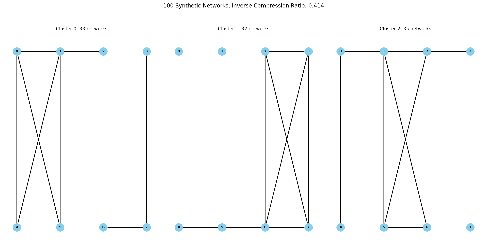

Clustering Network Populations
+++++++++

Tutorial 
===============
Code to perform clustering network populations derived in "Compressing network populations with modal networks reveals structural diversity" (Kirkley et al., 2023, https://arxiv.org/pdf/2209.13827). 

Inputs a list of edge sets corresponding to a population of node-aligned graphs, and requires input parameters:

- **edgesets:** List of edge sets. The s-th set contains all the edges (i, j) in the s-th network in the sample (do not include the other direction (j, i) if the network is undirected). The order of edgesets within the dataset only matters for contiguous clustering, where we want the edgesets to be in the order of the samples in time.
- **N:** Number of nodes in each network (including isolated nodes not showing up in the edge sets).
- **K0:** Initial number of clusters (for discontiguous clustering, usually K0 = 1 works well; for contiguous clustering, it does not matter).
- **n_fails:** Number of failed reassign/merge/split/merge-split moves before terminating the algorithm.
- **bipartite:** 'None' for unipartite network populations, list containing \[# of nodes of type 1, # of nodes of type 2\] otherwise.
- **directed:** Set to True when sets of edges input are directed.
- **max_runs:** Maximum number of allowed moves in the MCMC method, independent of the number of failed moves.

Outputs a clustering result of the form C, A, L where:

- **C:** Dictionary with items (cluster label):(set of list indices corresponding to edge sets in the cluster).
- **A:** Dictionary with items (cluster label):(set of edges corresponding to the mode of the cluster).
- **L:** Inverse compression ratio, which is the description length after clustering divided by the description length of naive transmission.

Algorithm minimizes the following Minimum Description Length (MDL) clustering objective over mode edge sets \{\mathcal{A}^{(k)}\} and cluster assignments \{C_k\} for the input edge sets:

.. _equation1:

.. math::
    :nowrap:

    \[
    \mathcal{L}(\mathcal{D}) = \sum_{k=1}^{K} \mathcal{L}_k\left(\mathcal{A}^{(k)}, C_k\right), 
    \]

where

.. _equation2:

.. math::
    :nowrap:

    \[
    \mathcal{L}_k\left(\mathcal{A}^{(k)}, C_k\right) = \mathcal{L}\left(\mathcal{A}^{(k)}\right) + S \log\left(\frac{S}{S_k}\right) + \ell_k 
    \]

is the cluster-level description length of Eq. 14 in https://arxiv.org/pdf/2209.13827.

**Inputs:**

- **edgesets:** List of edge sets. The s-th set contains all the edges (i, j) in the s-th network in the sample (do not include the other direction (j, i) if the network is undirected). The order of edgesets within the dataset only matters for contiguous clustering, where we want the edgesets to be in the order of the samples in time.
- **N:** Number of nodes in each network (including isolated nodes not showing up in the edge sets).
- **K0:** Initial number of clusters (for discontiguous clustering, usually K0 = 1 works well; for contiguous clustering, it does not matter).
- **n_fails:** Number of failed reassign/merge/split/merge-split moves before terminating the algorithm.
- **bipartite:** 'None' for unipartite network populations, list containing \[# of nodes of type 1, # of nodes of type 2\] otherwise.
- **directed:** Set to True when sets of edges input are directed.
- **max_runs:** Maximum number of allowed moves in the MCMC method, independent of the number of failed moves.

**Outputs of class methods 'run_sims' (unconstrained description length optimization) and 'dynamic_contiguous' (optimization restricted to contiguous clusters):**

- **C:** Dictionary with items (cluster label):(set of list indices corresponding to edge sets in the cluster).
- **A:** Dictionary with items (cluster label):(set of edges corresponding to the mode of the cluster).
- **L:** Inverse compression ratio, which is the description length after clustering divided by the description length of naive transmission.

**For discontiguous clustering, use:**

.. code-block:: python

    MDLobj = MDL_populations(edgesets, N, K0, n_fails, bipartite, directed, max_runs)
    MDLobj.initialize_clusters()
    C, A, L = MDLobj.run_sims()

**For contiguous clustering, use:**

.. code-block:: python

    MDLobj = MDL_populations(edgesets, N, K0=(anything), n_fails=(anything), bipartite, directed)
    C, A, L = MDLobj.dynamic_contiguous()

MDL Population Clustering
==========================

This module contains the code for the MDL (Minimum Description Length) network population clustering algorithm.

Functions
---------

All of the following functions are provided in this module and have the same general usage as described below.

.. list-table:: Functions
   :header-rows: 1

   * - Function
     - Description
   * - `generate_synthetic(S, N, modes, alphas, betas, pis) <#generate_synthetic>`_
     - Generate synthetic networks from the heterogeneous network population generative model in https://arxiv.org/abs/2107.07489.
   * - `generate_synthetic.ind2ij(ind, N) <#ind2ij>`_
     - Convert index to edge indices.
   * - `remap_keys(Dict) <#remap_keys>`_
     - Remap dict keys to first K integers.
   * - `MDL_populations.__init__(edgesets, N, K0=1, n_fails=100, bipartite=None, directed=False, max_runs=np.inf) <#MDL_populations_init>`_
     - Initialize the MDL_populations class.
   * - `MDL_populations.initialize_clusters() <#MDL_populations_initialize_clusters>`_
     - Initialize K0 random clusters and find their modes as well as the total description length of this configuration.
   * - `MDL_populations.random_key() <#MDL_populations_random_key>`_
     - Generate random key for new cluster.
   * - `MDL_populations.logchoose(N, K) <#MDL_populations_logchoose>`_
     - Compute the logarithm of the binomial coefficient.
   * - `MDL_populations.logmult(Ns) <#MDL_populations_logmult>`_
     - Compute the logarithm of the multinomial coefficient.
   * - `MDL_populations.generate_Ek(cluster) <#MDL_populations_generate_Ek>`_
     - Tally edge counts for networks in the cluster.
   * - `MDL_populations.update_mode(Ek, Sk) <#MDL_populations_update_mode>`_
     - Generate mode from cluster edge counts by greedily removing least common edges in the cluster.
   * - `MDL_populations.Lk(Ak, Ek, Sk) <#MDL_populations_Lk>`_
     - Compute cluster description length as a function of mode, edge counts, and size of the cluster.
   * - `MDL_populations.move1(k=None) <#MDL_populations_move1>`_
     - Reassign randomly chosen network to the best cluster.
   * - `MDL_populations.move2() <#MDL_populations_move2>`_
     - Merge two randomly chosen clusters.
   * - `MDL_populations.move3() <#MDL_populations_move3>`_
     - Split randomly chosen cluster in two and perform K-means type algorithm to get these clusters and modes.
   * - `MDL_populations.move4() <#MDL_populations_move4>`_
     - Merge two randomly chosen clusters then split them.
   * - `MDL_populations.run_sims() <#MDL_populations_run_sims>`_
     - Run discontiguous (unconstrained) merge split simulations to identify modes and clusters that minimize the description length.
   * - `MDL_populations.dynamic_contiguous() <#MDL_populations_dynamic_contiguous>`_
     - Minimize description length while constraining clusters to be contiguous in time.
   * - `MDL_populations.evaluate_partition(partition, contiguous=False) <#MDL_populations_evaluate_partition>`_
     - Evaluate description length of an arbitrary input partition.

Reference
=========

.. _generate_synthetic:

.. raw:: html

   

       function generate_synthetic(S, N, modes, alphas, betas, pis) 
       <a href="../Code/population_clustering.html#generate-synthetic" class="source-link">[source]</a>
   

**Description**:
Generate synthetic networks from the heterogeneous population model.

**Parameters**:

.. raw:: html

   

       (S, N, modes, alphas, betas, pis)
   

   <ul class="parameter-list">
       <li>S: Number of synthetic networks to generate.</li>
       <li>N: Number of nodes in each network.</li>
       <li>modes: List of modes for the population model.</li>
       <li>alphas: List of probabilities for true positive edges in each mode.</li>
       <li>betas: List of probabilities for false positive edges in each mode.</li>
       <li>pis: List of mixture weights for each mode.</li>
   </ul>

**Returns**:
  - **nets**: List of generated networks.
  - **cluster_labels**: List of cluster labels for the generated networks.

.. _ind2ij:

.. raw:: html

   

       function generate_synthetic.ind2ij(ind, N) 
       <a href="../Code/population_clustering.html#generate-synthetic" class="source-link">[source]</a>
   

**Description**:
Convert index to edge indices.

**Parameters**:

.. raw:: html

   

       (ind, N)
   

   <ul class="parameter-list">
       <li>ind: Index of the edge.</li>
       <li>N: Number of nodes in the network.</li>
   </ul>

**Returns**:
  - **tuple**: Edge indices (i, j).

.. _remap_keys:

.. raw:: html

   

       function remap_keys(Dict) 
       <a href="../Code/population_clustering.html#remap-keys" class="source-link">[source]</a>
   

**Description**:
Remap dict keys to first K integers.

**Parameters**:

.. raw:: html

   

       (Dict)
   

   <ul class="parameter-list">
       <li>Dict: Dictionary to remap.</li>
   </ul>

**Returns**:
  - **Dict**: Remapped dictionary.

.. _MDL_populations_init:

.. raw:: html

   

       class MDL_populations.__init__(edgesets, N, K0=1, n_fails=100, bipartite=None, directed=False, max_runs=np.inf) 
       <a href="../Code/population_clustering.html#mdl-populations-init" class="source-link">[source]</a>
   

**Description**:
Initialize the MDL_populations class.

**Parameters**:

.. raw:: html

   

       (edgesets, N, K0=1, n_fails=100, bipartite=None, directed=False, max_runs=np.inf)
   

   <ul class="parameter-list">
       <li>edgesets: List of sets. The s-th set contains all the edges (i, j) in the s-th network in the sample (do not include the other direction (j, i) if the network is undirected).</li>
       <li>N: Number of nodes in each network.</li>
       <li>K0: Initial number of clusters (for discontiguous clustering, usually K0 = 1 works well; for contiguous clustering, it does not matter).</li>
       <li>n_fails: Number of failed reassign/merge/split/merge-split moves before terminating the algorithm.</li>
       <li>bipartite: 'None' for unipartite network populations, array [# of nodes of type 1, # of nodes of type 2] otherwise.</li>
       <li>directed: Boolean indicating whether edgesets contain directed edges.</li>
       <li>max_runs: Maximum number of allowed moves, regardless of the number of fails.</li>
   </ul>

.. _MDL_populations_initialize_clusters:

.. raw:: html

   

       function MDL_populations.initialize_clusters() 
       <a href="../Code/population_clustering.html#mdl-populations-initialize-clusters" class="source-link">[source]</a>
   

**Description**:
Initialize K0 random clusters and find their modes as well as the total description length of this configuration.

.. _MDL_populations_random_key:

.. raw:: html

   

       function MDL_populations.random_key() 
       <a href="../Code/population_clustering.html#mdl-populations-random-key" class="source-link">[source]</a>
   

**Description**:
Generate random key for new cluster.

.. _MDL_populations_logchoose:

.. raw:: html

   

       function MDL_populations.logchoose(N, K) 
       <a href="../Code/population_clustering.html#mdl-populations-logchoose" class="source-link">[source]</a>
   

**Description**:
Compute the logarithm of the binomial coefficient.

**Parameters**:

.. raw:: html

   

       (N, K)
   

   <ul class="parameter-list">
       <li>N: Total number of items.</li>
       <li>K: Number of chosen items.</li>
   </ul>

**Returns**:
  - **float**: Logarithm of the binomial coefficient.

.. _MDL_populations_logmult:

.. raw:: html

   

       function MDL_populations.logmult(Ns) 
       <a href="../Code/population_clustering.html#mdl-populations-logmult" class="source-link">[source]</a>
   

**Description**:
Compute the logarithm of the multinomial coefficient with the denominator Ns[0]!Ns[1]!....

**Parameters**:

.. raw:: html

   

       (Ns)
   

   <ul class="parameter-list">
       <li>Ns: List of counts for the multinomial coefficient.</li>
   </ul>

**Returns**:
  - **float**: Logarithm of the multinomial coefficient.

.. _MDL_populations_generate_Ek:

.. raw:: html

   

       function MDL_populations.generate_Ek(cluster) 
       <a href="../Code/population_clustering.html#mdl-populations-generate-ek" class="source-link">[source]</a>
   

**Description**:
Tally edge counts for networks in the cluster.

**Parameters**:

.. raw:: html

   

       (cluster)
   

   <ul class="parameter-list">
       <li>cluster: Set of network indices in the cluster.</li>
   </ul>

**Returns**:
  - **Ek**: Dictionary of edge counts for the cluster.

.. _MDL_populations_update_mode:

.. raw:: html

   

       function MDL_populations.update_mode(Ek, Sk) 
       <a href="../Code/population_clustering.html#mdl-populations-update-mode" class="source-link">[source]</a>
   

**Description**:
Generate mode from cluster edge counts by greedily removing least common edges in the cluster.

**Parameters**:

.. raw:: html

   

       (Ek, Sk)
   

   <ul class="parameter-list">
       <li>Ek: Dictionary of edge counts for the cluster.</li>
       <li>Sk: Size of the cluster.</li>
   </ul>

**Returns**:
  - **Ak**: Set of edges corresponding to the mode of the cluster.

.. _MDL_populations_Lk:

.. raw:: html

   

       function MDL_populations.Lk(Ak, Ek, Sk) 
       <a href="../Code/population_clustering.html#mdl-populations-lk" class="source-link">[source]</a>
   

**Description**:
Compute cluster description length as a function of mode, edge counts, and size of the cluster.

**Parameters**:

.. raw:: html

   

       (Ak, Ek, Sk)
   

   <ul class="parameter-list">
       <li>Ak: Set of edges corresponding to the mode of the cluster.</li>
       <li>Ek: Dictionary of edge counts for the cluster.</li>
       <li>Sk: Size of the cluster.</li>
   </ul>

**Returns**:
  - **float**: Cluster description length.

.. _MDL_populations_move1:

.. raw:: html

   

       function MDL_populations.move1(k=None) 
       <a href="../Code/population_clustering.html#mdl-populations-move1" class="source-link">[source]</a>
   

**Description**:
Reassign randomly chosen network to the best cluster.

**Parameters**:

.. raw:: html

   

       (k=None)
   

   <ul class="parameter-list">
       <li>k: Cluster index (optional).</li>
   </ul>

**Returns**:
  - **bool**: Whether the move was accepted.
  - **float**: Change in description length.

.. _MDL_populations_move2:

.. raw:: html

   

       function MDL_populations.move2() 
       <a href="../Code/population_clustering.html#mdl-populations-move2" class="source-link">[source]</a>
   

**Description**:
Merge two randomly chosen clusters.

**Returns**:
  - **bool**: Whether the move was accepted.
  - **float**: Change in description length.

.. _MDL_populations_move3:

.. raw:: html

   

       function MDL_populations.move3() 
       <a href="../Code/population_clustering.html#mdl-populations-move3" class="source-link">[source]</a>
   

**Description**:
Split randomly chosen cluster in two and perform K-means type algorithm to get these clusters and modes.

**Returns**:
  - **bool**: Whether the move was accepted.
  - **float**: Change in description length.

.. _MDL_populations_move4:

.. raw:: html

   

       function MDL_populations.move4() 
       <a href="../Code/population_clustering.html#mdl-populations-move4" class="source-link">[source]</a>
   

**Description**:
Merge two randomly chosen clusters then split them.

**Returns**:
  - **bool**: Whether the move was accepted.
  - **float**: Change in description length.

.. _MDL_populations_run_sims:

.. raw:: html

   

       function MDL_populations.run_sims() 
       <a href="../Code/population_clustering.html#mdl-populations-run-sims" class="source-link">[source]</a>
   

**Description**:
Run discontiguous (unconstrained) merge split simulations to identify modes and clusters that minimize the description length.

**Returns**:
  - **C**: Dictionary with items (cluster label):(set of indices corresponding to networks in the cluster).
  - **A**: Dictionary with items (cluster label):(set of edges corresponding to the mode of the cluster).
  - **L**: Inverse compression ratio (description length after clustering)/(description length of naive transmission).

.. _MDL_populations_dynamic_contiguous:

.. raw:: html

   

       function MDL_populations.dynamic_contiguous() 
       <a href="../Code/population_clustering.html#mdl-populations-dynamic-contiguous" class="source-link">[source]</a>
   

**Description**:
Minimize description length while constraining clusters to be contiguous in time.

**Returns**:
  - **C**: Dictionary with items (cluster label):(set of indices corresponding to networks in the cluster).
  - **A**: Dictionary with items (cluster label):(set of edges corresponding to the mode of the cluster).
  - **L**: Inverse compression ratio (description length after clustering)/(description length of naive transmission).

.. _MDL_populations_evaluate_partition:

.. raw:: html

   

       function MDL_populations.evaluate_partition(partition, contiguous=False) 
       <a href="../Code/population_clustering.html#mdl-populations-evaluate-partition" class="source-link">[source]</a>
   

**Description**:
Evaluate description length of partition. 'Contiguous=True' removes the cluster label entropy term from description length.

**Parameters**:

.. raw:: html

   

       (partition, contiguous=False)
   

   <ul class="parameter-list">
       <li>partition: List of cluster labels for each network.</li>
       <li>contiguous: Boolean indicating whether to remove cluster label entropy term.</li>
   </ul>

**Returns**:
  - **float**: Description length of the partition.

Demo 
=======
Example Code
------------

**Step 1: Import necessary libraries**

.. code-block:: python

    import numpy as np
    import matplotlib.pyplot as plt
    import time
    import ScholarCodeCollective as SCC
    from ScholarCodeCollective.population_clustering import generate_synthetic, MDL_populations
    import networkx as nx
    import random

**Step 2: Function to visualize synthetic clusters**

.. code-block:: python

    def visualize_synthetic_clusters(nets, cluster_labels, node_num):
        num_plots = len(nets)
        cols = 3
        rows = (num_plots // cols) + (num_plots % cols > 0)
        fig, axes = plt.subplots(rows, cols, figsize=(15, 10))
        pos_rectangular = {}
        half_N = (node_num + 1) // 2
        for i in range(node_num):
            if i < half_N:
                pos_rectangular[i] = (i, 1)  
            else:
                pos_rectangular[i] = (i - half_N, 0) 

        for i, (net, cluster_label) in enumerate(zip(nets, cluster_labels)):
            row, col = divmod(i, cols)
            ax = axes[row, col] if rows > 1 else axes[col]
            G = nx.Graph()
            G.add_nodes_from(range(node_num))
            G.add_edges_from(net)
            
            nx.draw(G, pos_rectangular, with_labels=True, ax=ax, node_size=300, node_color='skyblue', font_weight='bold')
            ax.set_title(f'Network {i+1} (Mode {cluster_label})')
        
        for j in range(i + 1, rows * cols):
            fig.delaxes(axes.flatten()[j])
            
        plt.tight_layout()
        plt.savefig('synthetic_network_clusters.png', bbox_inches='tight', dpi=200)
        plt.show()

**Step 3: Generate synthetic data**

.. code-block:: python

    mode_example = [{(0, 1), (0, 4), (0, 5), (1, 4), (1, 5), (1, 2), (3, 7), (6, 7)}, 
        {(0, 1), (0, 4), (1, 2), (1, 5), (1, 6), (2, 5), (2, 6), (2, 3), (5, 6)}, 
        {(1, 5), (4, 5), (5, 6), (2, 3), (2, 6), (3, 6), (3, 7), (2, 7), (6, 7)}]

    node_num = 8
    network_num = 100
    nets, cluster_labels = generate_synthetic(
        S=network_num, 
        N=node_num, 
        modes=mode_example,
        alphas=[1, 1, 1], 
        betas=[0.1, 0.1, 0.1], 
        pis=[0.33, 0.33, 0.34]
    )

**Step 4: Visualize the synthetic networks**

.. code-block:: python

    visualize_synthetic_clusters(nets, cluster_labels, node_num)

**Step 5: Run the MDL network population clustering algorithm**

.. code-block:: python

    mdl_pop = MDL_populations(edgesets=nets, N=node_num, K0=1, n_fails=100, directed=False, max_runs=np.inf)
    mdl_pop.initialize_clusters()
    clusters, modes, L = mdl_pop.run_sims()

**Step 6: Function to visualize clustered networks**

.. code-block:: python

    def visualize_clusters(nets, clusters, L, N, network_num, filename='MDL_population_clusters.png'):
        num_clusters = len(clusters)
        fig, ax = plt.subplots(1, num_clusters, figsize=(15, 8))  

        if num_clusters == 1:
            ax = [ax]

        pos_rectangular = {}
        half_N = (N + 1) // 2
        for i in range(N):
            if i < half_N:
                pos_rectangular[i] = (i, 1) 
            else:
                pos_rectangular[i] = (i - half_N, 0)  

        for i, (k, v) in enumerate(clusters.items()):
            G = nx.Graph()
            G.add_nodes_from(range(N))
            for idx in v:
                G.add_edges_from(nets[idx])
            
            degrees = dict(G.degree())
            max_degree = max(degrees.values()) if degrees else 1
            node_sizes = [100 + 400 * degrees[node] / max_degree for node in G.nodes()]
            nx.draw(G, pos_rectangular, ax=ax[i], with_labels=True, node_size=node_sizes, node_color='skyblue', font_size=8, font_weight='bold', edge_color='black', width=1.5)
            num_networks = len(v)
            ax[i].set_title(f'Cluster {k}: {num_networks} networks, modes', fontsize=10)
            ax[i].axis('off') 

        plt.suptitle(f'{network_num} Sythetic Networks, Inverse Compression Ratio: {L:.3f}', fontsize=12)
        plt.tight_layout(rect=[0, 0.03, 1, 0.95])
        plt.savefig(filename, bbox_inches='tight', dpi=200)
        plt.show()

**Step 7: Visualize the clustered networks**

.. code-block:: python

    visualize_clusters(nets, clusters, L, node_num, network_num)

Example Output
--------------

.. figure:: synthetic_networks_population_example.png
    :alt: Nine sample networks from the specified synthetic population, with cluster labels.

    Nine sample networks from the specified synthetic population, with cluster labels. The index of the network sample and the mode it was generated from are indicated along with each sample.

MDL population clustering result. The optimal mode configuration inferred by the run_sims() method for discontiguous network population clustering is shown along with the number of clusters in each network. The inverse compression ratio of this clustering is displayed above the figure.

Paper source
====

If you use this algorithm in your work, please cite:

A. Kirkley*, A. Rojas, M. Rosvall, and J-G. Young, Compressing network populations with modal networks reveals structural diversity. Communications Physics 6, 148 (2023). 
Paper: https://arxiv.org/abs/2209.13827
